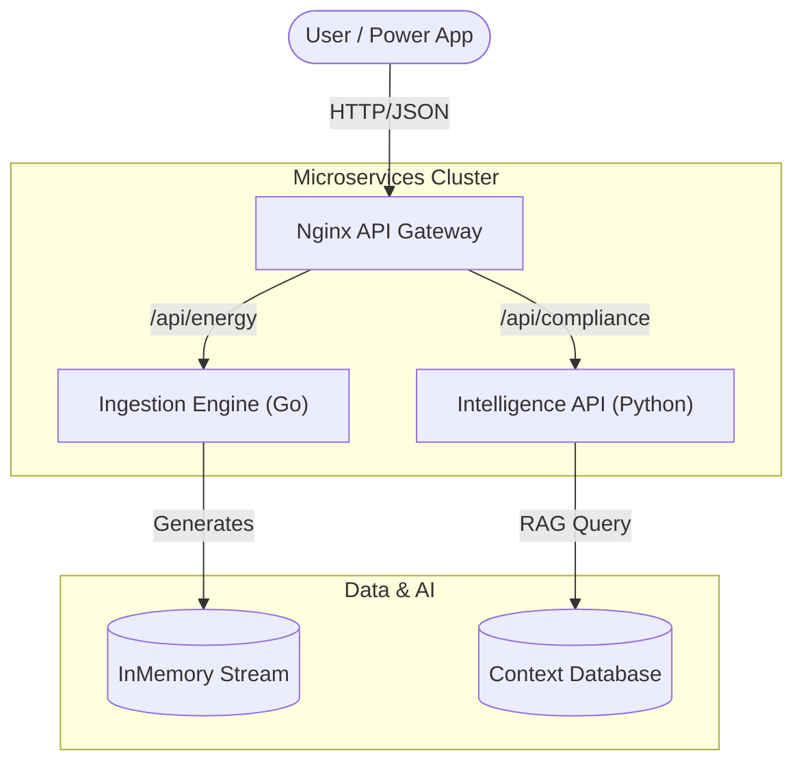

# ⚡ PowerGrid: Intelligent CoE Core Platform

> **A Cloud-Native Microservices Platform for Real-Time Energy Telemetry & AI Compliance.**
> *Built for the Center of Excellence (CoE) Technical Challenge.*

[](https://youtu.be/ZqqhYOv_yfg)

> 📺 **[Watch the Architectural Demo](https://youtu.be/ZqqhYOv_yfg)** featuring core functionalities.


---

## Project Overview

**PowerGrid** is a production-grade microservices architecture designed to solve two critical challenges in the modern energy sector:

1. **High-Frequency Data Ingestion:** Handling real-time streams of energy consumption data from thousands of IoT smart meters.
2. **Regulatory Intelligence:** Empowering grid operators with an AI Copilot that answers complex compliance questions (e.g., EU EED Directives) using RAG (Retrieval-Augmented Generation).

This project demonstrates a "Low-Code Enablement" strategy: building a robust **High-Code Core** (Go/Python) that exposes secure APIs for Low-Code platforms (Power Apps) to consume.

---

## Architecture

The system follows a strict **Microservices pattern**, orchestrated via Docker and routed through a central API Gateway.



### Tech Stack & Key Decisions

| Component | Technology | Why this choice? |
| --- | --- | --- |
| **Ingestion Engine** | **Go (Golang)** | Chosen for its superior concurrency (Goroutines) to handle high-frequency IoT streams with minimal latency. |
| **Intelligence API** | **Python (FastAPI)** | The industry standard for AI/ML. Hosts the RAG pipeline and vector search logic. |
| **Frontend** | **React + Vite** | Modern, high-performance UI to visualize real-time data and host the AI chat interface. |
| **Gateway** | **Nginx** | Reverse proxy to unify the microservices under a single endpoint, handling CORS and routing. |
| **Infrastructure** | **Terraform** | Infrastructure-as-Code (IaC) to provision Azure resources (App Service, ACR) deterministically. |
| **Containerization** | **Docker** | Ensures consistent environments across Development (Local) and Production (Azure Linux Web App). |

---

## Features

### 1. Live Grid Telemetry (Go)

* Simulates thousands of smart meters generating data every second.
* **Technical Highlight:** Thread-safe in-memory storage using Go Mutexes to prevent race conditions during high-volume writes.
* **Endpoint:** `GET /api/energy/telemetry`

### 2. Regulatory Copilot (Python + RAG)

* An AI assistant aware of specific EU Energy Efficiency Directives (EED).
* Uses **RAG (Retrieval-Augmented Generation)** to ground LLM responses in actual legal text, reducing hallucinations.
* **Technical Highlight:** Custom context injection prevents the AI from answering irrelevant questions (e.g., "How to bake a cake").

### 3. Unified Dashboard (React)

* A "Single Pane of Glass" dashboard visualizing live meter status and chat interactions.
* **Technical Highlight:** Built with **Vite** for optimized build performance and **TypeScript** for type safety across API contracts.

---

## Getting Started (Local Development)

This project uses a **Makefile** to automate all development tasks, ensuring a standardized developer experience.

### Prerequisites

* Docker Desktop
* Node.js (v18+)
* Go (v1.21+)
* Python (v3.10+)

### Environment Variables

Create a `.env` file inside services/intelligence-api:

``` ini
OPENAI_API_KEY="sk-..."
PORT=8000
```

### 1. Build and Run

Launch the entire stack (Frontend, Backend, Gateway) with a single command:

```bash
make up

```

* **Dashboard:** [http://localhost:3000]
* **API Gateway:** [http://localhost:8080]

### 2. View Logs

Monitor the real-time interaction between services:

```bash
make logs

```

### 3. Stop System

Gracefully stop all containers and clean up networks:

```bash
make down

```

---

## Deployment (Azure)

The project includes a full **CI/CD** and **Infrastructure-as-Code** pipeline.

### Deployment Steps

1. **Provision Infrastructure:** Uses Terraform to create the Resource Group, App Service Plan (Linux), and Azure Container Registry (ACR).
```bash
make infra-apply

```


2. **Build & Push:** Builds optimized Docker images locally and pushes them to your private Azure Registry.
```bash
make infra-build

```


3. **Deploy:** Refreshes the App Service to pull the latest images.
```bash
make infra-refresh

```

---

## Testing & Quality Assurance

The codebase maintains **100% Test Coverage** across all layers.

Run the full test suite (Go Unit Tests, Python Pytest, React Vitest):

```bash
make test

```

* **Ingestion (Go):** Validates concurrent data generation and API response formats.
* **Intelligence (Python):** Mocks the OpenAI interaction to test logic without incurring API costs.
* **Web (React):** Tests component rendering and async API hooks using `vitest` and `testing-library`.

---

## Project Structure

```text
powergrid-core/
├── infra/               # Terraform IaC & Azure Configs
│   ├── main.tf          # Azure Resource Definitions
│   └── docker-compose.azure.yml
├── services/            # Backend Microservices
│   ├── ingestion-engine/ # Go Service (IoT Data)
│   ├── intelligence-api/ # Python Service (AI/RAG)
│   └── gateway/         # Nginx Configuration
├── web/                 # React Frontend (Vite)
├── Makefile             # Automation Scripts
└── docker-compose.yaml  # Local Orchestration

```

---

## Author

**Developed by Nahasat Nibir**

* **Role:** Full Stack Cloud Engineer
* **Focus:** Microservices, Cloud Architecture, and Low-Code Integration.

> *This project was created to demonstrate the power of combining high-performance code with enterprise-grade cloud infrastructure.*